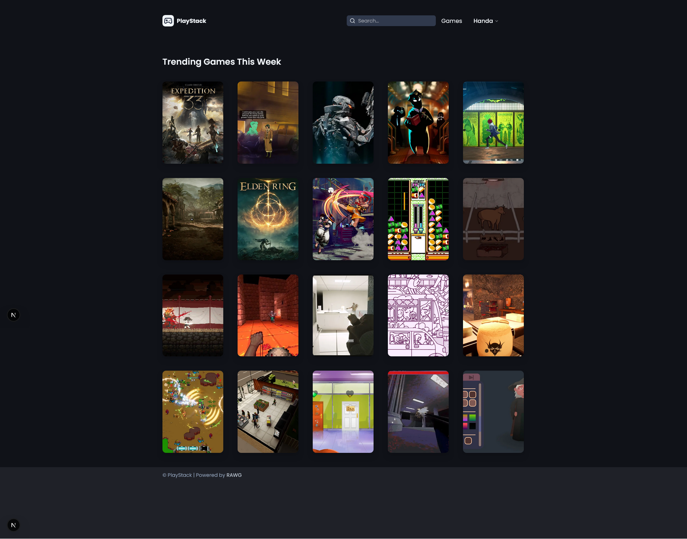
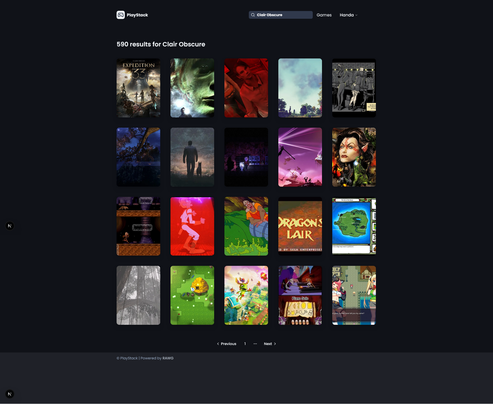
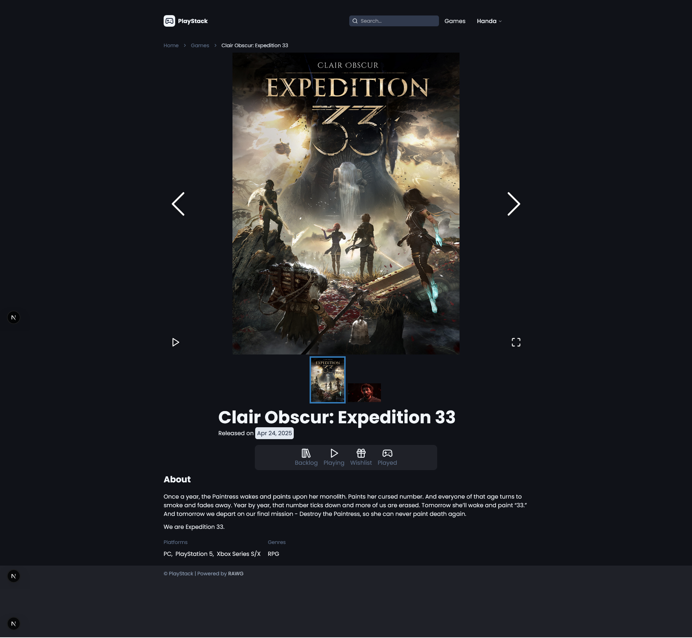
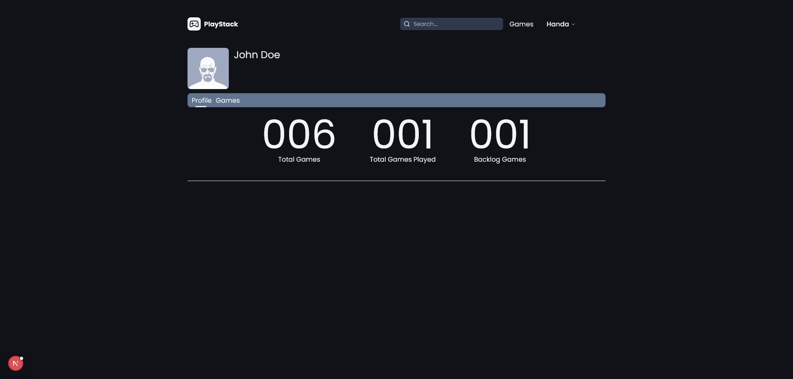
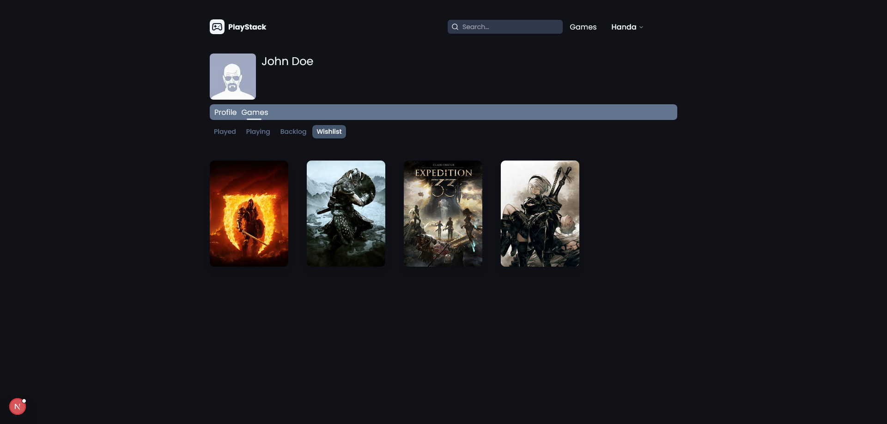
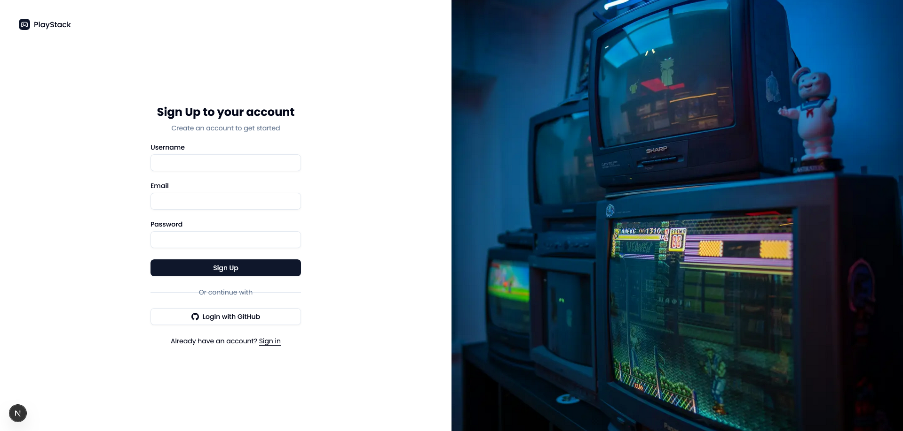

# PlayStack
 
**PlayStack** is a web application designed to help gamers manage their video game backlogs. Inspired by to-do list apps and media tracking platforms, PlayStack allows users to track their games across five categories: Backlog, Playing, Wishlist, Completed, and Stopped Playing. Built as a portfolio project, PlayStack showcases development skills with a focus on user experience, API integration, and state management.

---

## Features

- **Game Tracking**: Add games to five categories: Backlog, Playing, Wishlist, Completed, and Stopped Playing.
- **Guest Mode with Local Storage**: Use the app without signing up, storing data in the browser’s localStorage. 
- **Optional Authentication**: Sign up or sign in to save your data to a PostgreSQL database (planned feature).
- **Game Discovery**: Browse trending games and view detailed game information using the RAWG API.
- **Responsive Design**: A modern, gaming-inspired UI built with Tailwind CSS and Shadcn components, featuring dark mode support.
- **Interactive UI**: Hover effects on game cards, toast notifications for user actions, and a clean layout for easy navigation.

---

## Screenshots
<div style="margin-top: 12px; margin-bottom: 12px">
  <a href="">
    
  </a>
</div>

<div style="margin-top: 12px; margin-bottom: 12px">
  <a href="">
    
  </a>
</div>

<div style="margin-top: 12px; margin-bottom: 12px">
  <a href="">
    
  </a>
</div>

<div style="margin-top: 12px; margin-bottom: 12px">
  <a href="">
    
  </a>
</div>

<div style="margin-top: 12px; margin-bottom: 12px">
  <a href="">
    
  </a>
</div>

<div style="margin-top: 12px; margin-bottom: 12px">
  <a href="">
    
  </a>
</div>

---

## Tech Stack 🛠️

- **Frontend**: Next.js (App Router), React, TypeScript, Tailwind CSS, Shadcn UI
- **Backend** (planned): PostgreSQL with Neon, Drizzle ORM, NextAuth.js
- **API Integration**: RAWG Video Games Database API
- **State Management**: Local Storage for guest mode, zustand (planned for enhanced state management)
- **Deployment**: Vercel (planned)

---


## Setup Instructions 🚀
### Prerequisites

- Node.js (v18 or higher)
- npm or yarn
- A RAWG API key (sign up at rawg.io)

### Installation

1. Clone the Repository:
```bash
git clone https://github.com/your-username/playstack.git
cd playstack
```

2. Install Dependencies:
```bash
npm install
```

3. Set Up Environment Variables:Create a .env file in the root directory and add your RAWG API key:
```bash
RAWG_API_KEY=your-rawg-api-key
```

4. Run the Development Server:
```bash
npm run dev
```

5. Open http://localhost:3000 in your browser to see the app.

---

## Usage

1. **Browse Trending Games**:

    - Visit the homepage to see trending games fetched from the RAWG API, sorted by popularity (ordering=-added).
    - Click on a game to view its details.


2. **Add Games to Categories**:

    - On the game detail page, click one of the category buttons (e.g., "Add to Backlog") to add the game to your list.
    - Data is saved to localStorage for guest users.


3. **View Your Games**:

    - Navigate to the profile page (/profile/games) to see your games organized by category.

---

## Future Improvements

- **User Authentication**: Implement NextAuth.js for signup/signin and sync localStorage data to PostgreSQL.
- **Enhanced State Management**: Use zustand for better client-side state management.
- **Game Recommendations**: Add a feature to suggest games based on user categories.
- **Advanced Features**: Include game ratings, personal notes, and a statistics dashboard.

---

## Acknowledgments

- RAWG API for providing a comprehensive video game database.
- Shadcn UI for accessible and customizable components.
- Tailwind CSS for a utility-first CSS framework.

---
